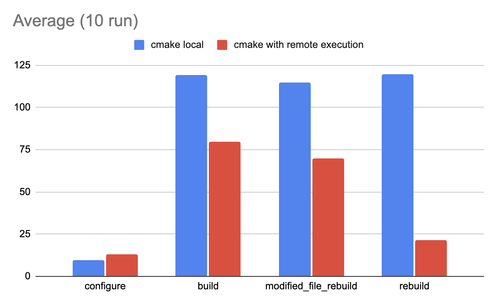
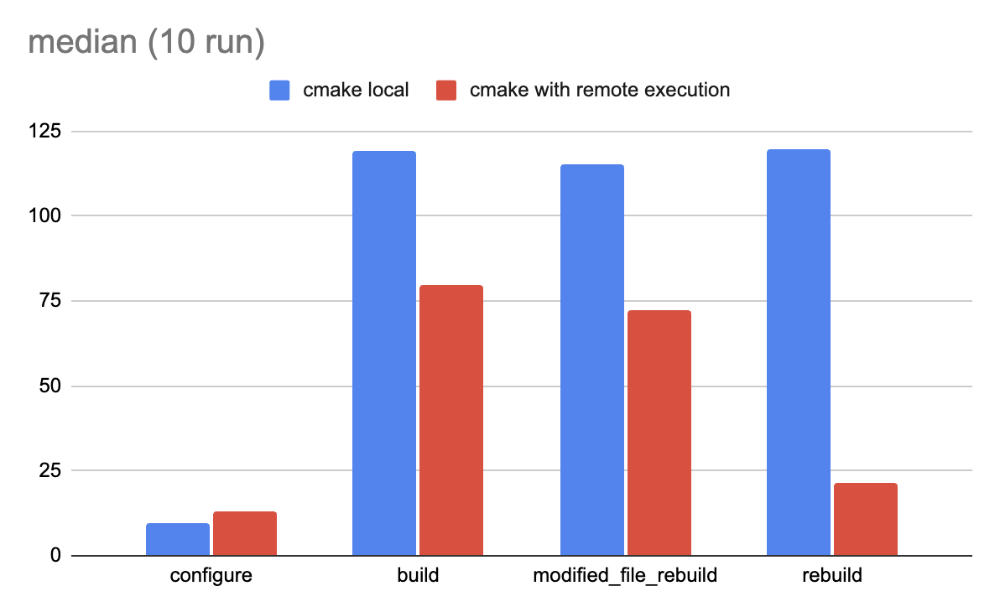
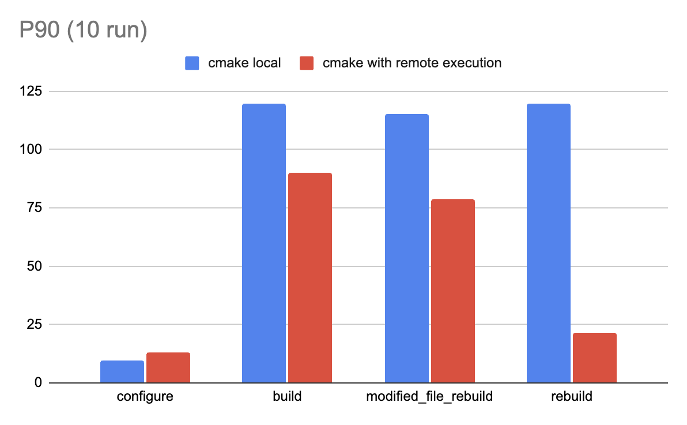

# Kitware-benchmark

Reference benchmark for comparing local CMake builds against cmake-re remote execution builds. Compiles a minimal configuration of VTK (Kitware's Visualization Toolkit) and measures configure, build, modified-file rebuild (changing `Common/Core/vtkObject.h` to trigger a cascade), and clean rebuild times across 10 iterations.

For each iteration the benchmark runs inside a Docker container (`linux-kitware-paraview`) on the `linux-kitware-paraview-vtk-mini` toolchain. The `cmake` scenario runs entirely locally, while `cmake-re` offloads compilation to an EngFlow RBE cluster. Before the `cmake-re` runs, a cluster preheat phase warms the remote workers (4 parallel preheat builds) so that the timed iterations reflect steady-state remote execution rather than cold-start latency.

## Results





Based on median values, `cmake-re` remote builds deliver significant speedups: **1.5x faster** for initial builds (79.74s vs 119.45s), **1.6x faster** for modified file rebuilds (72.48s vs 115.05s), and **5.6x faster** for clean rebuilds (21.36s vs 119.69s)

## Result Details : On AWS EC2 c8a.8xlarge

This reference provided results have been produced by running the benchmark as described in this document on an AWS EC2 c8a.8xlarge instance hosted in `us-east-1` (32 core AMD EPYC 9R45 Processor, 64 GiB, provisioned IO2 EBS volume with 100000 IOPS).

 | Run | `cmake configure` | `cmake build`| `cmake  modified file rebuild` | `cmake rebuild` |           
  |------|-----------|-----------|-----------|-------|        
  |  1 | 9.67 | 118.84 | 114.52 | 118.95 |                
  |  2 | 9.8 | 119.02 | 114.38 | 119.04 |                 
  |  3 | 9.79 | 119.29 | 114.89 | 119.52 |                
  |  4 | 9.79 | 119.49 | 115.1 | 119.41 |                 
  |  5 | 9.83 | 119.47 | 114.99 | 120.1 |                 
  |  6 | 9.76 | 119.39 | 115.24 | 119.73 |                
  |  7 | 9.83 | 119.79 | 115.14 | 119.71 |                
  |  8 | 9.8 | 119.42 | 115.16 | 119.66 |                 
  |  9 | 9.83 | 119.6 | 115 | 120 |                       
  |  10 | 9.83 | 119.68 | 115.52 | 119.78 |               
  | **average** | **9.793** | **119.399** | **114.994** | **119.59** |                         
  | **median** | **9.8** | **119.445** | **115.05** | **119.685** |                            
  | **P90** |  **9.83** | **119.691** | **115.268** | **120.01** |  


| Run | `cmake-re configure` | `cmake-re build`| `cmake-re  modified file rebuild` | `cmake-re rebuild` |           
  |------|-----------|-----------|-----------|-------|                                 
  | 1 | 12.97 | 76.6 | 77.63 | 21.17 |                                                             
  | 2 | 13.06 | 74.51 | 73.32 | 21.57 |                                                            
  | 3 | 13.08 | 71.63 | 61.4 | 21.17 |                                                             
  | 4 | 13.08 | 80.76 | 62.3 | 20.92 |                                                             
  | 5 | 13.09 | 78.72 | 80.41 | 21.32 |                                                            
  | 6 | 12.96 | 80.95 | 78.39 | 21.41 |                                                            
  | 7 | 12.97 | 66.78 | 63.39 | 21.64 |                                                            
  | 8 | 13.01 | 94.8 | 74.06 | 21.4 |                                                              
  | 9 | 13.01 | 84.2 | 55.72 | 21.64 |                                                             
  | 10 | 12.98 | 89.29 | 71.64 | 20.92 |                                                           
  | **average** | **13.021** | **79.824** | **69.826** | **21.316** |                              
  | **median** | **13.01** | **79.74** | **72.48** | **21.36** |                                   
  | **P90** | **13.081** | **89.841** | **78.592** | **21.64** |  


  | Statistic | `cmake configure` | `cmake-re configure` | `cmake build` | `cmake-re build` | `cmake modified file rebuild` | `cmake-re modified file rebuild` | `cmake rebuild` | `cmake-re rebuild` |
|---|---|---|---|---|---|---|---|---|
| **average** | 9.793 | 13.021 | 119.399 | 79.824 | 114.994 | 69.826 | 119.59 | 21.316 |
| **median** | 9.8 | 13.01 | 119.445 | 79.74 | 115.05 | 72.48 | 119.685 | 21.36 |
| **P90** | 9.83 | 13.081 | 119.691 | 89.841 | 115.268 | 78.592 | 120.01 | 21.64 |

## To run this benchmark:

An `engflow-mtls` folder (with all credentials inside) should be present in the machine's home directory

Run the following commands:
```bash
cd vtk/
python3 ./benchmark.py config.json
```

Wait and find the results in the `<output_dir>/benchmark-results.json`or in `<output_dir>/benchmark-results.csv`