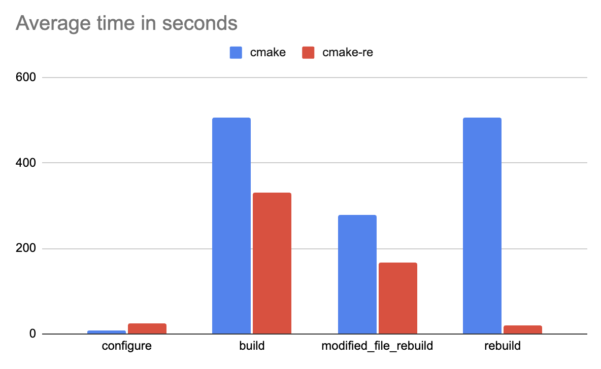
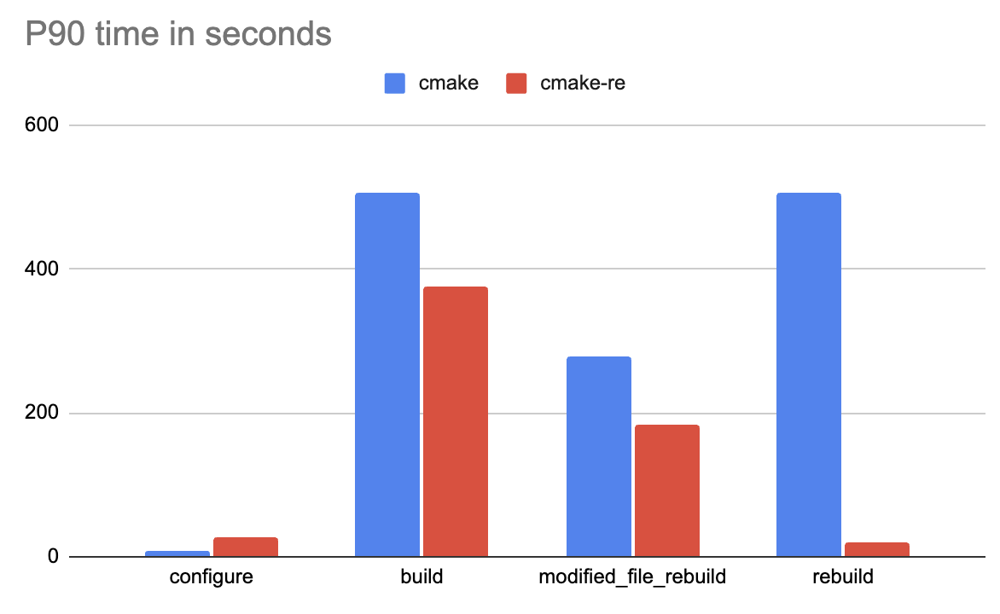

# LLVM Benchmark

Reference benchmark for comparing local CMake builds against cmake-re remote execution builds. Compiles LLVM and measures configure, build, modified-file rebuild, and clean rebuild times across 10 iterations.

For each iteration the benchmark runs inside a Docker container on the `linux-ubuntu-2404-cxx20` toolchain. The `cmake` scenario runs entirely locally, while `cmake-re` offloads compilation to an EngFlow RBE cluster. Before the `cmake-re` runs, a cluster preheat phase warms the remote workers so that the timed iterations reflect steady-state remote execution rather than cold-start latency.

## Results





Based on median values, `cmake-re` remote builds deliver significant speedups: **1.47x faster** for initial builds (345.12s vs 505.86s), **26.6x faster** for clean rebuilds (19.05s vs 506.12s), and **1.69x faster** for modified file rebuilds (165.33s vs 279.3s)

## Result Details : On AWS EC2 c8a.8xlarge

This reference provided results have been produced by running the benchmark as described in this document on an AWS EC2 c8a.8xlarge instance hosted in `us-east-1` (32 core AMD EPYC 9R45 Processor, 64 GiB, provisioned IO2 EBS volume with 100000 IOPS).

 | Run | `cmake configure` | `cmake build`| `cmake modified file rebuild` | `cmake rebuild` |
 |------|-----------|-----------|-----------|-------|
 | 1 | 9.35 | 504.98 | 278.39 | 505.21 |
 | 2 | 9.02 | 505.82 | 278.31 | 505.74 |
 | 3 | 9.06 | 505.63 | 278.8 | 505.88 |
 | 4 | 9.11 | 505.67 | 279.3 | 506.08 |
 | 5 | 9.09 | 505.86 | 279.32 | 506.07 |
 | 6 | 9.08 | 505.91 | 279.28 | 506.12 |
 | 7 | 9.12 | 506.04 | 279.45 | 506.19 |
 | 8 | 9.07 | 505.78 | 278.51 | 506.23 |
 | 9 | 9.1 | 506.11 | 279.62 | 506.31 |
 | 10 | 9.13 | 505.95 | 279.48 | 506.15 |
 | **average** | **9.113** | **505.775** | **279.046** | **505.998** |
 | **median** | **9.09** | **505.86** | **279.3** | **506.12** |
 | **P90** | **9.123** | **506.061** | **279.522** | **506.254** |


| Run | `cmake-re configure` | `cmake-re build`| `cmake-re modified file rebuild` | `cmake-re rebuild` |
 |------|-----------|-----------|-----------|-------|
 | 1 | 26.18 | 314.47 | 158.61 | 19.33 |
 | 2 | 25.75 | 368.76 | 172.96 | 18.47 |
 | 3 | 25.8 | 263.23 | 191.79 | 19.61 |
 | 4 | 25.94 | 372.59 | 160.14 | 19.16 |
 | 5 | 25.73 | 382.81 | 152.5 | 18.9 |
 | 6 | 25.85 | 345.12 | 165.33 | 19.05 |
 | 7 | 26.02 | 298.64 | 178.42 | 18.73 |
 | 8 | 25.68 | 356.91 | 155.87 | 19.42 |
 | 9 | 25.91 | 321.08 | 169.25 | 18.88 |
 | 10 | 26.07 | 275.44 | 163.1 | 19.27 |
 | **average** | **25.893** | **329.905** | **166.797** | **19.082** |
 | **median** | **25.85** | **345.12** | **165.33** | **19.05** |
 | **P90** | **26.035** | **375.656** | **182.431** | **19.477** |


 | Statistic | `cmake configure` | `cmake-re configure` | `cmake build` | `cmake-re build` | `cmake modified file rebuild` | `cmake-re modified file rebuild` | `cmake rebuild` | `cmake-re rebuild` |
|---|---|---|---|---|---|---|---|---|
| **average** | 9.113 | 25.893 | 505.775 | 329.905 | 279.046 | 166.797 | 505.998 | 19.082 |
| **median** | 9.09 | 25.85 | 505.86 | 345.12 | 279.3 | 165.33 | 506.12 | 19.05 |
| **P90** | 9.123 | 26.035 | 506.061 | 375.656 | 279.522 | 182.431 | 506.254 | 19.477 |

## To run this benchmark:

An `engflow-mtls` folder (with all credentials inside) should be present in the machine's home directory

Run the following commands:
```bash
cd llvm/
python3 ../benchmark.py config.json
```

Wait and find the results in the `<output_dir>/benchmark-results.json` or in `<output_dir>/benchmark-results.csv`
